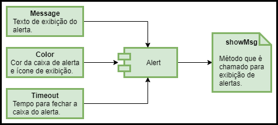

# Desafio Operand
Como solicitado, foi desenvolvida uma aplicação (utilizando Vue.Js) que contempla o CRUD de usuários (Criação, Leitura/Consulta, Alteração e Exclusão). 

- Página para testes no Firebase: https://operand-challenge.web.app/
- Repositório da API (backend): https://github.com/Luizbrandt/user-crud-simple-api

### Visão Geral do Projeto

#### Operações
Para o desenvolvimento deste projeto, uma API simples (sem autenticação) foi desenvolvida, contendo os seguintes métodos:
- POST: criação de usuários (Cadastro).
- GET: consulta de usuários (Busca).
- PUT: alteração de dados cadastrais (Update).
- DELETE: exclusão de usuários.

#### Entidade

<p align="justify">
  A entidade 'Usuário' contém quatro atributos, sendo o atributo primário o '_id', do tipo UUID (Identificador Único Universal). Os outros atributos são: 'nome', 'cpf' e 'email', todos do tipo string.
</p>

<p align="center">
  </img>
</p>

### Páginas e Layout

#### Página Principal

<p align="justify">
  Contém a tabela de dados, listando os usuários cadastrados, com as informações: Nome, E-mail e CPF. Segue o layout de barra superior (estilo retirada da página do <a href="https://www.operand.com.br/">Operand</a>), logo da empresa, card principal centralizado contendo respectivamente, a busca de usuários cadastrados via campo de texto, listagem em formato de tabela dos usuários cadastrados (linha representa um usuário, coluna representa um atriuto), ações de Edição e Exclusão dos usuários cadastrados, e por fim, criação de novos usuários (Cadastro).
</p>

<p align="center">
  </img>
</p>

#### Página de Cadastro - Inserção de Usuários

<p align="justify">
  Contém logo superior, card centralizado, com os campos para inserção dos dados do novo usuário (Nome, CPF e Email). Botões de ação - submissão e limpeza do formulário, bem como o redirecionamento para a página principal.
</p>

<p align="center">
  </img>
</p>

#### Página de Edição - Update

<p align="justify">
  Consiste numa dialog, janela modal, aberta com ocorrência de um evento. Neste caso, pressionar o botão de ação, na listagem de usuários. Como os valores de Nome e CPF são estáticos, somente o campo de e-mail pode ser atualizado, contendo os botões de ação de editar (Submissão do Formulário) e cancelas (fecha a dialog e retorna ao contexto de listagem de usuários da página principal).
</p>

<p align="center">
  </img>
</p>

#### Página de Exclusão - Delete

<p align="justify">
  Assim como no caso do menu anterior, é formada por uma dialog, acionada com o pressionamento do botão de ação de exclusão da listagem principal. Exibe uma mensagem de confirmação, com os campos (apenas para leitura) dos atributos do usuário que se deseja excluir. Com a confirmação da ação, o usuário é excluído, recarregando a listagem com os dados atualizados.
</p>

<p align="center">
  </img>
</p>

### Organização de Pastas e Arquivos
- src/: Pasta raiz do projeto.
- src/assets: Pasta que contém o material gráfico utilizado, como logo e imagens (na pasta './img').
- src/components: Pasta que contém os componentes do Vue.Js criados para o projeto.
- src/plugins/vuetify.js: Arquivo de configuração do Vuetify, biblioteca de interface de usuário (UI) do vue, com estilos, templates e componentes personalizados.
- src/router/index.js: Arquivo JavaScript de configuração do router, aplicativo de paginação utilizado no projeto.
- src/services: Pasta que contém as funções JavaScript de validação de dados e consumo da API.
- src/views: Páginas secundárias do projeto, criadas com arquivos do Vue.js.
- src/App.vue: Instância principal do Vue -> página que fornece acesso à todas as views.
- src/main.js: Arquivo JavaScript principal, que controla a instância do Vue, adicionando pacotes e definindo configurações de projeto.

### Componentes

#### Alert

<p align="justify">
  Mensagem via alerta que muda de cor e ícone dependendo do seu tipo. Tipos disponíveis: 'error', 'sucess', 'info' e 'warning'. É utilizada após a conclusão de operações de consumo da API, para indicar ao usuário o status da requisição.
</p>

<p align="center">
  </img>
</p>

#### Button

<p align="justify">
  Botão que redireciona para uma dada página do projeto. Contém os atributos: cor, ícone, texto e página, e todos são passados pela comunicação com o componente pai em que é declarado.
</p>

<p align="center">
  </img>
</p>


#### Card Toolbar

<p align="justify">
  Barra superior dos cards, contendo texto, cor e ícone, ambos passados como 'prop' pelo componente pai em que é declarada.
</p>

<p align="center">
  </img>
</p>

#### Delete User

<p align="justify">
  Botão do tipo ícone, é exibido no menu de ações de listagem de usuários. Recebe os dados do usuário como 'prop', fornecendo a função de exclusão do usuário. Conforme recebe a resposta da requisição que invoca, emite eventos ao componente pai, os quais permitem a impressão de mensgagens via 'Alert'.
</p>

<!--<p align="center">
  </img>
</p>-->

<p align="center">
  </img>
</p>


#### Edit User

<p align="justify">
  Botão do tipo ícone, é exibido no menu de ações de listagem de usuários. Recebe os dados do usuário como 'prop', fornecendo a função de edição do usuário. Conforme recebe a resposta da requisição que invoca, emite eventos ao componente pai, os quais permitem a impressão de mensgagens via 'Alert'.
</p>

<p align="center">
  </img>
</p>

#### Loading

<p align="justify">
  Componente de exibição que indica que uma comunicação com API ainda não terminou. É invocado com parâmetro booleano, que indica que a comunicação com API foi chamada. Com completude da ação, sai da tela.
</p>

<p align="center">
  </img>
</p>

#### Top Bar

<p align="justify">
  Barra superior principal, utilizada direto no arquivo principal da instância do Vue, 'App.vue'.
</p>

<p align="center">
  </img>
</p>

### Instalação dos Pacotes:
Para a instalação dos pacotes, é necessário clonar este repositório em sua máquina. Na pasta raiz do projeto, rode os sequintes comandos:
- Para instalação dos módulos do Node.Js:
```
npm i
```
- Para a inicialização da aplicação:
```
npm run serve
```
